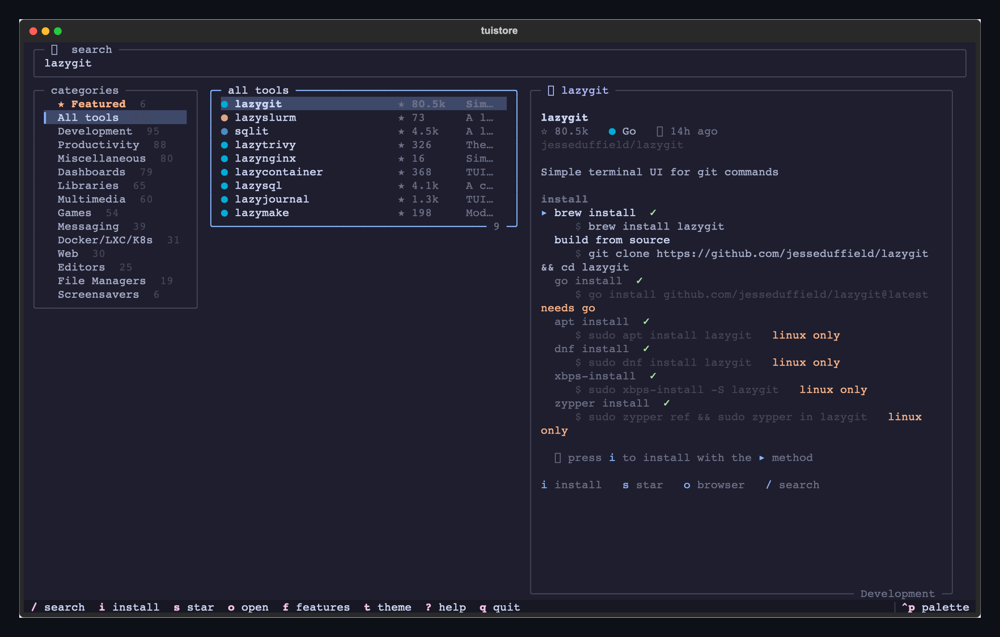
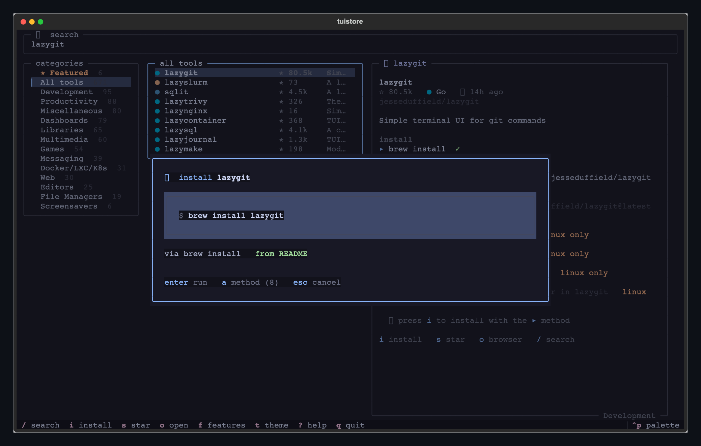
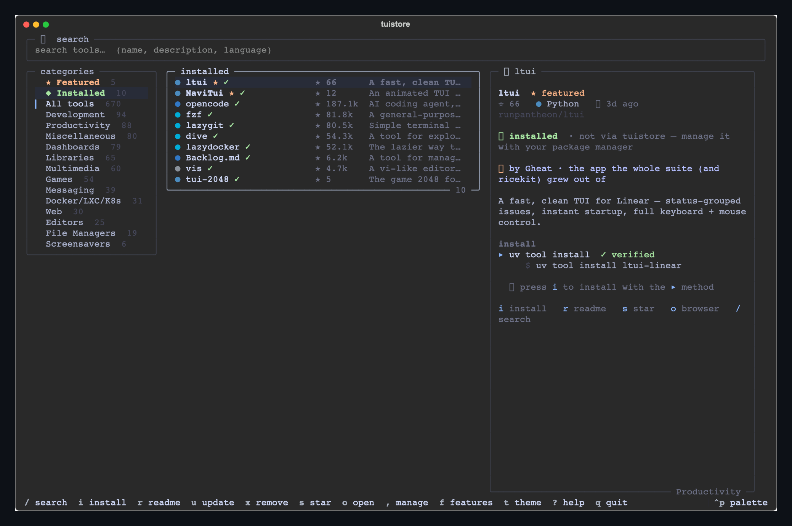

<div align="center">

# 🛍️ tuistore

**The TUI app store — find, search, and one-key-install hundreds of terminal apps, without leaving the terminal.**

Browse a curated catalog of TUIs, read the details, and install with a single
key — tuistore figures out *how* to install each one on **your** machine
(cargo, brew, pacman, uv, go, docker…) so you never paste a command your box
can't run. Star the ones you love straight to GitHub.

Built on [🍚 ricekit](https://github.com/Gheat1/ricekit) · seeded from
[awesome-tuis](https://github.com/rothgar/awesome-tuis) · made by [@Gheat1](https://github.com/Gheat1)




</div>

---

## what it is

Finding good terminal apps means trawling GitHub and awesome-lists; installing
them means guessing whether it's `cargo install`, `brew install`, `pacman -S`,
`uv tool install`, a `curl | sh` script, or building from source — and half the
commands in a README are for the *wrong* OS.

tuistore fixes both. It's a fast, mouse-and-keyboard TUI that:

- puts **670+ curated TUIs** one fuzzy-search away,
- shows you the **install commands that actually work on your machine**, ranked,
- installs them with **one key** and streams the output live,
- and lets you **★ star** anything you like on GitHub, from the store.

## install

```sh
uv tool install git+https://github.com/Gheat1/tuistore   # recommended
# or
pipx install git+https://github.com/Gheat1/tuistore
```

Then just run:

```sh
tuistore
```

<sub>Starring uses the [`gh` CLI](https://cli.github.com) if you have it
(`gh auth login`); everything else works without it. tuistore itself installs
nothing but itself — it drives the package managers you already have.</sub>

## use it

Dead simple: **type to search, arrow to browse, `i` to install.**

```
 /            focus search — type a name, description, or language
 ↑ ↓ · j k    move through the list        g / G   jump to top / bottom
 enter        open / focus a tool
 i            install  (press a to pick a different method)
 r            read the README in-app (inspect before you install)
 u            update  ·  x  uninstall   (tools you installed via tuistore)
 s            star / unstar on GitHub    o       open the repo in your browser
 ,            manage (update tuistore · refetch catalog · update all)
 f            features / about            t       cycle theme
 ?            all keybindings             q       quit
```

Everything clicks, too — rows, the hint bar, and the draggable pane dividers.

<div align="center">

</div>

## how the install engine works

This is the hard part, and it's the point of tuistore.

1. **It reads your machine.** OS, Linux distro *family* (Arch, Debian, Fedora,
   SUSE, Void, Alpine, Gentoo…), CPU arch, and every package manager /
   toolchain actually on your `PATH`.
2. **Every tool carries platform-gated install methods.** A method knows what
   binaries it needs and where it's allowed to run, so `pacman -S` only appears
   on Arch, `brew` only where brew exists, `cargo` only where cargo is.
3. **Methods come from three places, and the UI labels which is which:**
   - ✓ **official** — commands the project itself documents (hand-verified for
     the featured suite),
   - ✓ **from README** — scraped straight out of each repo's README (kept only
     when the command actually names the tool, so dependency lines don't leak),
   - ⚠ **unverified** — a best-guess from the repo's language, flagged so you
     know to check it.
4. **It ranks what's runnable** and offers the winner as the default — a clean
   managed install (brew / cargo / uv) before a `curl | sh`, verified before
   guessed — with every alternative one keypress (`a`) away.
5. **Before you commit, you can look.** The install screen shows the exact
   command with a clear **✓ verified / ⚠ unverified** badge (and a loud warning
   on remote `curl | sh` scripts), and **`r` opens the project's README right in
   the store** so you can inspect a tool before you install it.
6. **It runs in your login shell** and streams the output live — nothing is ever
   run silently; you always see the exact command and confirm it.

<div align="center">

</div>

## installed, updates & uninstall

tuistore isn't just a browser — it's a package manager for the tools it installs.

- It **remembers what it installed** (which manager, which command), and also
  **detects** tools already on your `PATH`. The **◆ Installed** filter in the
  sidebar shows everything you have.
- On any tool tuistore installed, **`u` updates** it and **`x` uninstalls** it —
  in place, with the right command for the manager it used (`brew upgrade …`,
  `cargo uninstall …`, `uv tool upgrade …`, and so on), streamed live.
- **`,` opens the manage menu**: *update tuistore itself*, *refetch the catalog*
  (pull the newest tool list without reinstalling), or *update everything you've
  installed* in one go.

<div align="center">

</div>

### it's a CLI package manager too

Everything works from the shell, so tuistore drops straight into dotfiles,
setup scripts, and READMEs:

```sh
tuistore install lazygit     # resolve + install (platform-aware, confirmed)
tuistore install btop++ -y   # -y to skip the prompt (great for scripts/CI)
tuistore remove lazygit      # uninstall a tool you installed via tuistore
tuistore update lazygit      # update one tool
tuistore search git          # search the catalog
tuistore info btop++         # details + every install method

tuistore installed           # list what tuistore installed
tuistore update              # update tuistore itself
tuistore update installed    # update every tool tuistore installed
tuistore refetch catalog     # pull the latest catalog
tuistore --doctor            # what your machine looks like to the install engine
```

A shell install uses the same engine (verified-before-guessed, platform-gated)
and is recorded in the same ledger — so `tuistore installed`, `update`,
`remove`, and the TUI's **◆ Installed** view all stay in sync.

## the catalog

- **★ Featured — the suite.** [ltui](https://github.com/runpantheon/ltui),
  [jtui](https://github.com/Gheat1/jtui), [sctui](https://github.com/Gheat1/sctui),
  [NaviTui](https://github.com/Gheat1/NaviTui), and
  [ricekit](https://github.com/Gheat1/ricekit) — pinned to the top.
- **670+ tools** from [rothgar/awesome-tuis](https://github.com/rothgar/awesome-tuis),
  grouped into 13 browsable categories, each enriched with live GitHub stars,
  language, and freshness.

Refresh or grow the catalog any time — it's a single re-runnable script:

```sh
uv run python tools/build_catalog.py            # refresh stars + installs
uv run python tools/build_catalog.py --scrape 300   # scrape more READMEs
```

It parses awesome-tuis, batches a GraphQL sweep for stars/language/freshness,
scrapes install commands for the most-starred tools, and infers the rest.

## built on ricekit

tuistore is part of a family. It's built on
[**🍚 ricekit**](https://github.com/Gheat1/ricekit) — the themes, widgets,
modals, icons, and design doctrine behind the whole suite — so it shares the
five themes (`mocha` · `void` · `onyx` · `clear` · `system`), the vim-and-mouse
navigation, the drag-to-resize panes, and the cache-first speed.

If you like tuistore, you'll probably like the rest of the suite:

| | |
| --- | --- |
| [**ltui**](https://github.com/runpantheon/ltui) | a fast, clean TUI for Linear |
| [**jtui**](https://github.com/Gheat1/jtui) | the same, for Jira |
| [**sctui**](https://github.com/Gheat1/sctui) | the same, for Shortcut |
| [**NaviTui**](https://github.com/Gheat1/NaviTui) | an animated terminal player for Navidrome |
| [**ricekit**](https://github.com/Gheat1/ricekit) | the design system all of them share |

## config & data

XDG dirs, via ricekit's `AppDirs`:

| what | where |
| --- | --- |
| state (theme, layout) | `~/.local/state/tuistore/state.json` |
| cache (scraped installs) | `~/.cache/tuistore/` |
| the catalog | shipped in the package (`tuistore/data/catalog.json`) |

`tuistore --doctor` prints what your machine looks like to the install engine.

## contributing

Missing a tool, or a better install command? The catalog lives in
`tuistore/data/catalog.json` and is regenerated by `tools/build_catalog.py` —
PRs to add tools, fix install methods, or improve scraping are very welcome.
The awesome-tuis list itself is the upstream source for most entries.

## license

[**GPL-3.0-or-later**](LICENSE), **with additional terms under Section 7** (see
[`LICENSE`](LICENSE) / [`NOTICE`](NOTICE)):

- the **tuistore** name, the 🛍️ mark, and Gheat's branding are reserved — a
  fork or redistribution **must be renamed** and de-branded, so it can't be
  passed off as tuistore;
- **attribution** to the original author + a link back must be preserved;
- you may **not misrepresent the origin** or claim you authored the original.

Fork it and hack on it all you like — just don't ship my work as your own
project. Made by [@Gheat1](https://github.com/Gheat1), built on
[ricekit](https://github.com/Gheat1/ricekit).
